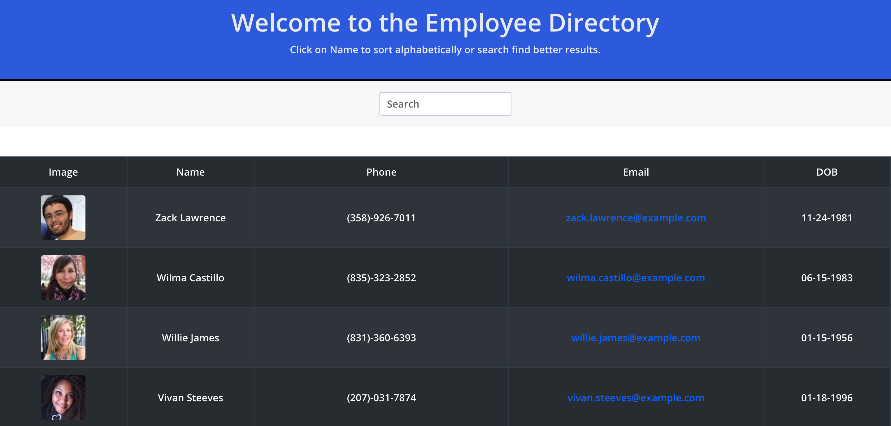

# React-Employee-Directory

 ## Table of Contents
1. [Description](#description)

3. [Usage](#usage)

4. [Links](#links)

5. [Contributions](#contributions)

6. [Questions](#questions)

## Description

For this assignment, you'll create a employee directory with React. This assignment will require you to break up your application's UI into components, manage component state, and respond to user events.

## User Story

* As a user, I want to be able to view my entire employee directory at once so that I have quick access to their information.

## Business Context

An employee or manager would benefit greatly from being able to view non-sensitive data about other employees. It would be particularly helpful to be able to filter employees by name.

## Acceptance Criteria

Given a table of random users generated from the [Random User API](https://randomuser.me/), when the user loads the page, a table of employees should render. 

The user should be able to:

  * Sort the table by at least one category

  * Filter the users by at least one property.

## Usage

### Links

[Deployed Github Repo] https://github.com/Jbarbss/React-Employee-Directory/

[Github Pages Site] https://jbarbss.github.io/React-Employee-Directory/

 
## Contributions
---
 

## Questions
 ---
  Please email me with any question regarding this project @ JBarbanel@gmail.com and connect with me on Github and LinkedIn.
 

   

  

Copyright (c) 2021 Jason Barbanel

## License
 

   https://opensource.org/licenses/MIT

Licensed under the MIT License

Copyright © [2021] [Jason Barbanel]
    
 Permission is hereby granted, free of charge, to any person obtaining a copy of this software and associated documentation files (the "Software"), to deal in the Software without restriction, including without limitation the rights to use, copy, modify, merge, publish, distribute, sublicense, and/or sell copies of the Software, and to permit persons to whom the Software is furnished to do so, subject to the following conditions:
        
The above copyright notice and this permission notice shall be included in all copies or substantial portions of the Software.
        
THE SOFTWARE IS PROVIDED "AS IS", WITHOUT WARRANTY OF ANY KIND, EXPRESS OR IMPLIED, INCLUDING BUT NOT LIMITED TO THE WARRANTIES OF MERCHANTABILITY, FITNESS FOR A PARTICULAR PURPOSE AND NONINFRINGEMENT. IN NO EVENT SHALL THE AUTHORS OR COPYRIGHT HOLDERS BE LIABLE FOR ANY CLAIM, DAMAGES OR OTHER LIABILITY, WHETHER IN AN ACTION OF CONTRACT, TORT OR OTHERWISE, ARISING FROM, OUT OF OR IN CONNECTION WITH THE SOFTWARE OR THE USE OR OTHER DEALINGS IN THE SOFTWARE

